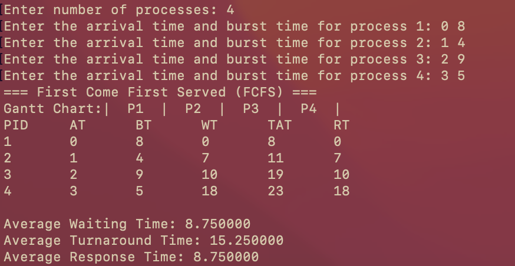
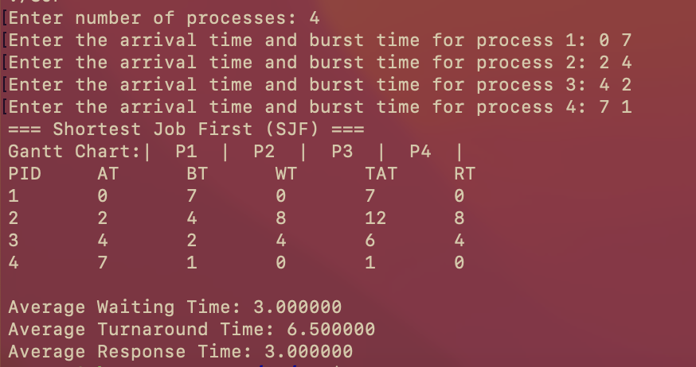

Operating Systems HW 7
Schedulers 

Use the makefiles to test the code.

To compile the programs do (same thing for SJF: makefile.SJF):
```bash
make -f makefile.FCFS
```
To test it:
```bash
make -f makefile.FCFS run
```
To clean up:
```bash
make -f makefile.FCFS clean
```





 
